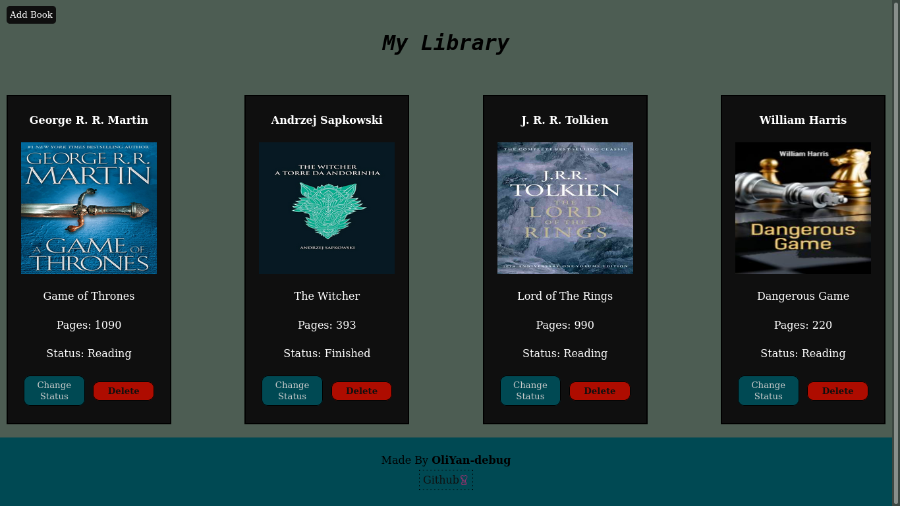

# Small Library App (Odin Project)


##  Requirements

- Project Skeleton [Done]

- Books Stored in a simple array and a function to get the user input and store new booka in the array

    - ```javascript I'm A tab
        let myLibrary = [];
        form.addEventListener("submit", (e) => {
            e.preventDefault()
        }
        ```
- Function to loop the array of books
    - ```javascript
        function showBooks()
      ```
- Button to add a new book
    - ```html
        <button id="btn"">Add Book</button>
        ```
- Button to Change Read Status
    - ```javascript
        let statusBtn = document.createElement("button");
        statusBtn.innerText = "Change Status";
        statusBtn.setAttribute("onclick", `changeStatus(${myLibrary.indexOf(book)})`);
        ```
#### The full resolution can be found here:
[Javascript](https://github.com/OliYan-debug/Small-Library-VanillaJs/blob/main/Js/script.js)

[Live Preview](https://oliyan-debug.github.io/Small-Library-VanillaJs/)